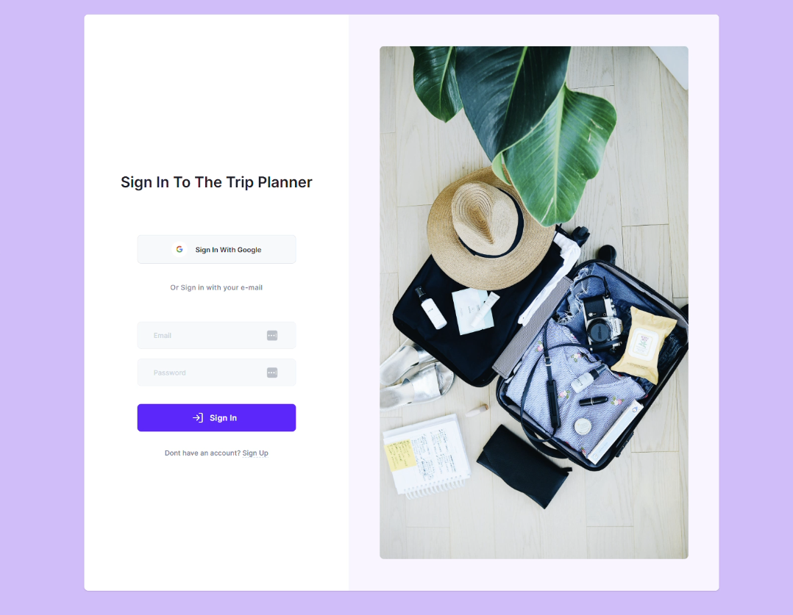
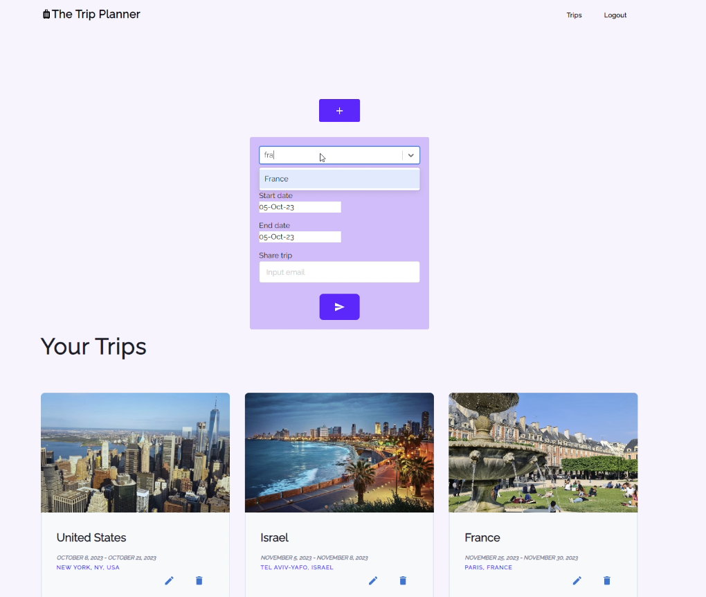
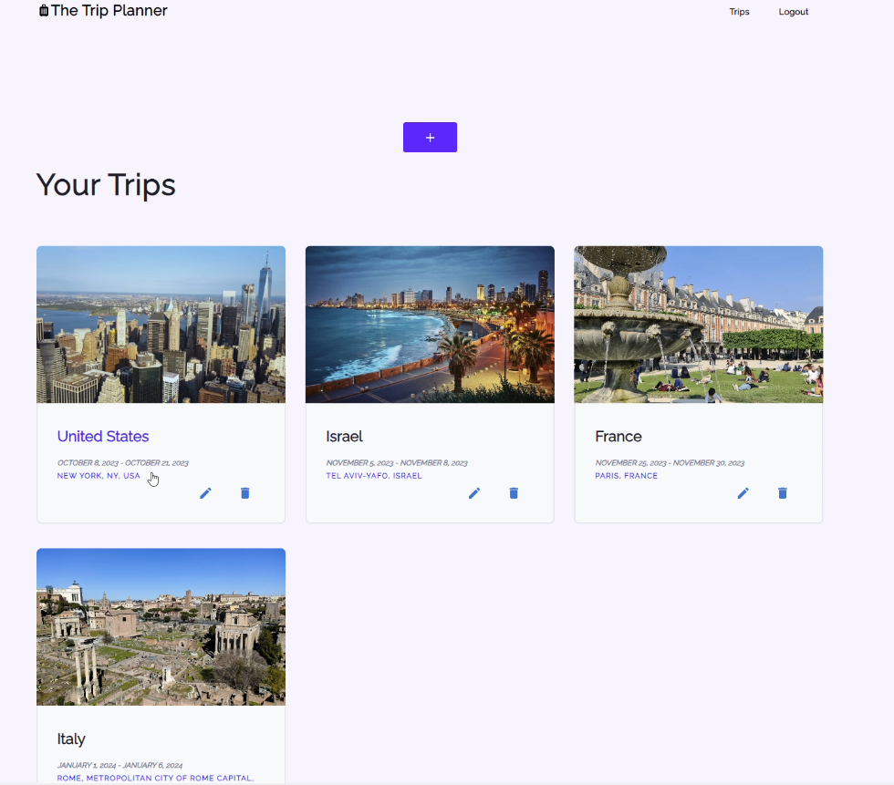
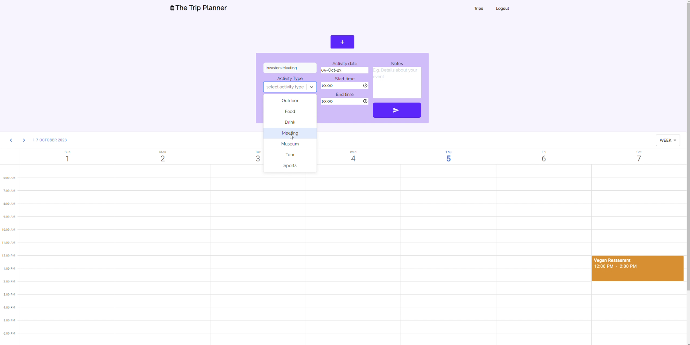
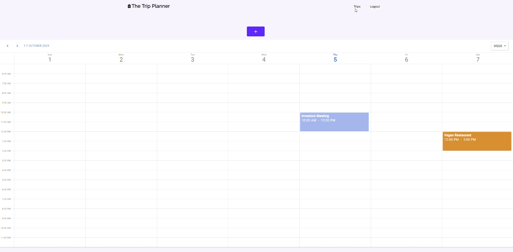

#The Trip Planner
###Developed by Inbal Gamliel
This is a web app that enables it's users to plan out trips- whther they are a vaction or for work. 
The user who creates the trip can also share it with other users who are registered to the app. 
Those users can add events to the trip scheduler.
[Live preview of the web app](http://bit.ly/48fo60Z).
[The Trip Planner web app](https://trip-planner-n1g3.onrender.com/login).

###Main features - Backend
**Users can choose how to sign up for the app**

- Regular registration where they use a valid email and create their own password and username.
- Google sign up where they use their google account to register.

If a user chooses to sign up using his Google account the following will occur-

His email will be set as the email and his google display name will be set as the nickname.
His password will not be saved in the DB.
His profile id will be saved under a specific table (Federated Credentials) in the DB that represents a Google sign up.
If the user signed up using Google, the next time he will log in, the existing user record will be found via its relation to the Google account (using his Google profile id).

**Trip Sharing**
Users can share trips with other registered users.
Once a user creates a trip, there's an option to add emails of other users in order to share the trip with them.
Users who are shared cannot edit / delete the trip. They can add activities and events to the trip scheduler.
Only the user who created the trip can edit / delete it.

The user who created the trip can add emails and also remove emails while editing the trip.

###Main features - Frontend
**Creating a trip**
On the main page, trips, there's an add button that allows users to create a new trip.
Once the trip is created, using Unsplash's API the trip appears with a relevant image of the location.

In addition, the user who created the trip can delete it or edit it. Users that were shared with the trip cannot, they will not even see those options.

The trips are shown using the trip card component.

**Trip scheduler**
This component represents the dates of the trip.
After the creation of a trip, users can click on the trip card and they will see the scheduler. There they can add different activities to the trip.

Those activities can be edited or removed.
When an activity is clicked, users can add comments on that activity. This is very helpful when the trip is shared as it represents a way of communication between the travellers.

